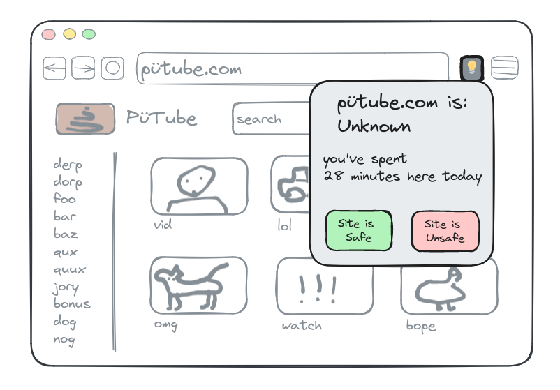
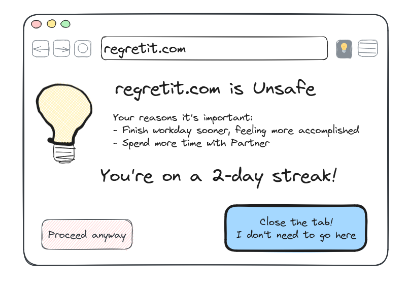
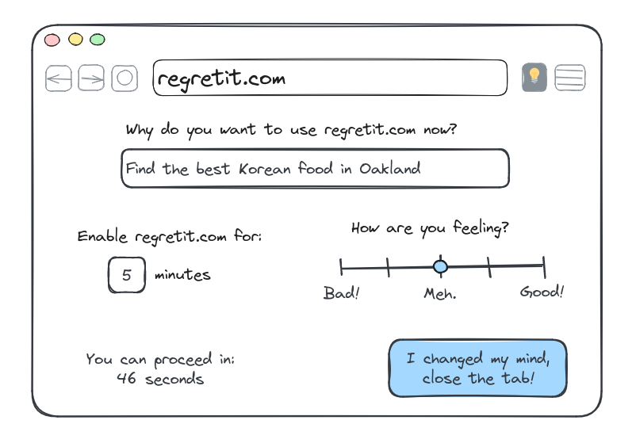
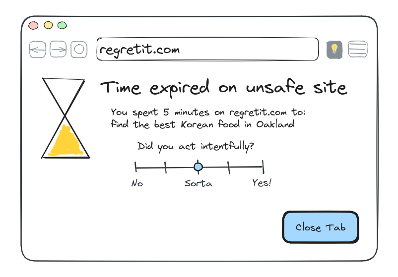

Intentful: browser extension that provides a new approach to managing your attention and focus online.

## How it Works

Mark web sites as unsafe if you're prone to using them compulsively or getting sidetracked when you visit.



When you try to load an unsafe site, the extension nudges you toward more intentful behavior.



If you're still determined to proceed, you must write why you're visiting the unsafe site, set a time limit, and wait a few moments for any impulsiveness to pass. Only then can you proceed to the unsafe site.



Once your time limit expires, Intentful encourages self-reflection and nudges you away from the unsafe site again.



## Development Status

Proof of concept. Works in Firefox.

## Test Mode

Enable test mode for development purposes. It reduces the waiting periods from ~30 seconds to ~3, so you can test changes quickly.

First, browser to `about:debugging#/runtime/this-firefox`, and inspect the extension:


Then enter in the extension-specific developer console:

```js
browser.storage.local.set({mode: "testMode"});
```

Then reload the extension.


