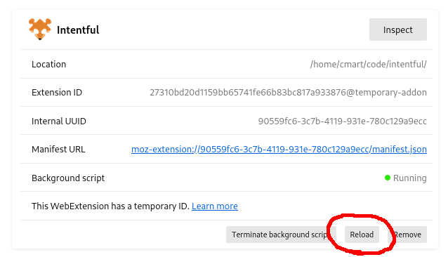

## Test Mode

Enable test mode for development purposes. It reduces the waiting periods from ~30 seconds to ~3, so you can test changes quickly.

First, browser to `about:debugging#/runtime/this-firefox`, and inspect the extension:


Then enter in the extension-specific developer console:

```js
browser.storage.local.set({mode: "testMode"});
```

Then reload the extension.



